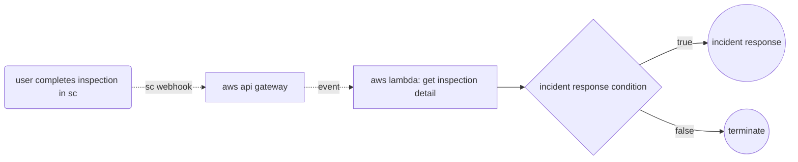

# Conditional Incident Response
This example demonstrates how completing an inspection can trigger a incident response workflow in the event that a condition is met. This is a common use case that leverages exisiting infrastructure to ensure that incidents or potential incidents are responded to in real time. 

## Workflow Illustration


## Notes
This example uses environment variables to store the API token. Note that other options and best practices are available for securely storing credentials, depending on your needs.

```js
const token = process.env.TOKEN; //best practices should be considered!
```

`index.mjs` illustrates a simple process to handle conditions while processing inspection data. Of course, this can be built upon according to business needs or leverage other supported SafetyCulture trigger events.  

```js
async function processData(data) {
  //define various conditions
  const condition = data.exampleCondition
  if(condition === true) {
    //follow up action
  } else {
    //no follow up action
  }
};
```

## Relevant Documentation
- [SafetyCulture API Authentication](https://developer.safetyculture.com/reference/authentication) 
- [SafetyCulture API Documentation](developer.safetyculture.com)
    - [SafetyCulture Trigger Events](https://developer.safetyculture.com/reference/webhooks)
    - [API: Get Inspection Details](https://developer.safetyculture.com/reference/externalinspectionservice_getinspectiondetails)
- [AWS Lambda](https://docs.aws.amazon.com/lambda/latest/dg/welcome.html)
