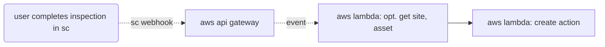

# Creating Actions from Inspections
This example demonstrates how completing an inspection can trigger the creation of an action to review. While this example is more general, this code can be referenced as an example to leverage API calls from an inspection completion event in SafetyCulture.

## Workflow Illustration


## Notes
This example uses environment variables to store the API token. Note that other options and best practices are available for securely storing credentials, depending on your needs.

```js
const token = process.env.TOKEN; //best practices should be considered!
```

This example uses spread syntax to conditionally include fields in a follow-up API call, useful for APIs that don’t accept `null` values. In customizable systems like SafetyCulture, fields may be left blank by users, or not always present. Spread syntax ensures only non-null fields are included, keeping requests compatible and clean.
```js
body: JSON.stringify({
  title: `Review inspection: ${insTitle}`,
  description: `Automated review of ${insTitle}`,
  ...(siteId && { site_id: siteId }), //only includes site_id if present in inspection, as null values are not accepted
  ...(assetId && { asset_id: assetId }) //only includes asset_id if present in inspection, as null values are not accepted
})

```

## Relevant Documentation
- [SafetyCulture API Authentication](https://developer.safetyculture.com/reference/authentication) 
- [SafetyCulture API Documentation](developer.safetyculture.com)
    - [SafetyCulture Trigger Events](https://developer.safetyculture.com/reference/webhooks)
    - [API: Get Inspection Details](https://developer.safetyculture.com/reference/externalinspectionservice_getinspectiondetails)
- [AWS Lambda](https://docs.aws.amazon.com/lambda/latest/dg/welcome.html)
