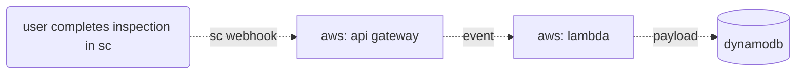

# Logging Inspections to DynamoBD
This example demonstrates how inspections can be easily logged to a data source, supporting reporting and automation efforts.

## Workflow Illustration


## Notes
This example uses environment variables to store the API token and DynamoDB table name. Note that other options and best practices are available for securely storing credentials, depending on your needs.

```js
const token = process.env.TOKEN; //best practices should be considered!
const table = process.env.DYNAMO_TABLE_NAME
```

This example uses a minimal output format. Refer to the SafetyCulture API documentation for a more comprehensive understanding of available keys. In this example, the sample payload is structured as follows:
```json
{
    "id": "value",
    "title": "value",
    "site_id": "value",
    "site_name": "value",
    "template_id": "value",
    "template_name": "value",
    "last_modified_by_id": "value",
    "last_modified_by_name": "value"
  }
```

## Relevant Documentation
- [SafetyCulture API Authentication](https://developer.safetyculture.com/reference/authentication) 
- [SafetyCulture API Documentation](developer.safetyculture.com)
    - [SafetyCulture Trigger Events](https://developer.safetyculture.com/reference/webhooks)
    - [API: Get Inspection Details](https://developer.safetyculture.com/reference/externalinspectionservice_getinspectiondetails)
- [AWS Lambda](https://docs.aws.amazon.com/lambda/latest/dg/welcome.html)
- [Amazon DynamoDB](https://docs.aws.amazon.com/amazondynamodb/latest/developerguide/Introduction.html)
